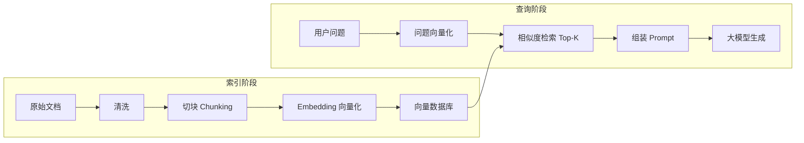

# 第 09 讲学习笔记 | 理解 RAG 全貌与语义搜索

> 本文为第 09 讲的精简学习笔记版。

## 学习目标

这一讲先不急着写代码，重点建立 RAG 的整体认知。

学完需要回答清楚四个问题：

1. RAG 到底解决什么问题？
2. RAG 的索引阶段和查询阶段分别做什么？
3. 为什么要做文档分块、Embedding 和向量检索？
4. 一个完整 RAG 问答链路是怎么跑起来的？

一句话概括：

> RAG 就是让大模型回答前先查资料，再基于查到的资料生成答案。

## 一、为什么需要 RAG

大模型有三个典型局限：

| 问题 | 说明 |
| --- | --- |
| 不知道私有知识 | 例如公司制度、内部文档、客户记录 |
| 不知道最新知识 | 模型知识停留在训练截止时间 |
| 容易编造 | 没有资料时可能生成看似合理但错误的答案 |

例子：

```text
用户问：我们公司今年的报销政策是什么？
普通大模型：我无法知道你们公司的内部政策，但可以提供通用框架。
```

这不是用户真正想要的答案。

RAG 的思路是：

```text
不重新训练模型
不让模型死记硬背全部知识
而是在回答前从知识库里检索相关资料
```

## 二、RAG 和微调的区别

| 方案 | 适合解决什么 | 不适合什么 |
| --- | --- | --- |
| RAG | 私有知识问答、文档问答、知识频繁更新 | 改变模型行为风格或深层能力 |
| 微调 | 固定任务格式、风格迁移、领域表达习惯 | 高频更新知识、少量文档知识注入 |

简单判断：

```text
知识经常变：优先 RAG
回答风格或任务能力要变：考虑微调
```

企业知识库、产品文档、政策制度、客服知识库，通常优先用 RAG。

## 三、RAG 三个字母

| 字母 | 含义 | 做什么 |
| --- | --- | --- |
| R | Retrieval，检索 | 从知识库找相关资料 |
| A | Augmented，增强 | 把资料加入模型上下文 |
| G | Generation，生成 | 大模型基于资料回答 |

类比：

```text
普通问答：闭卷考试
RAG 问答：开卷考试
```

RAG 不要求模型背下所有知识，而是让模型学会“带着资料作答”。

## 四、RAG 两个阶段

RAG 可以拆成两个阶段：

- 索引阶段：提前整理资料。
- 查询阶段：用户提问时检索并生成答案。



## 五、索引阶段做什么

索引阶段发生在用户提问之前。

目标：

> 把各种原始文档整理成可以被快速检索的知识库。

核心步骤：

| 步骤 | 作用 |
| --- | --- |
| 文档导入 | 读取 PDF、Word、Markdown、网页、数据库等 |
| 文档清洗 | 去掉页眉页脚、目录噪音、重复内容 |
| 文档分块 | 把长文档切成较小 Chunk |
| Embedding | 把每个 Chunk 转成向量 |
| 入库 | 把向量、原文和元数据写入向量数据库 |

元数据也很重要：

- 文件名
- 页码
- 标题
- 来源链接
- 更新时间
- 权限范围

没有元数据，后续很难做引用、溯源和权限控制。

## 六、查询阶段做什么

查询阶段发生在用户提问时。

目标：

> 找到和问题最相关的资料，再让大模型基于这些资料回答。

核心步骤：

| 步骤 | 作用 |
| --- | --- |
| 问题向量化 | 把用户问题转成向量 |
| 相似度检索 | 从向量数据库找 Top-K 相关 Chunk |
| 结果过滤 | 过滤低相似度、无权限或无关结果 |
| Prompt 组装 | 把资料、问题和规则拼起来 |
| 生成答案 | 大模型基于资料输出最终回答 |

完整链路：

```text
用户问题
  ↓
问题向量化
  ↓
检索 Top-K 文档块
  ↓
组装 Prompt
  ↓
大模型生成答案
  ↓
返回答案和引用来源
```

## 七、为什么要文档分块

不能把整篇文档或整个知识库直接塞给大模型，原因有三个：

1. 成本高：上下文越长，token 成本越高。
2. 效果差：信息太多会稀释重点。
3. 检索粗：整篇文档命中时，里面可能只有一句话相关。

分块的目标：

```text
让每个 Chunk 足够小，方便检索
让每个 Chunk 足够完整，保留语义
```

常见经验值：

| 参数 | 建议 |
| --- | --- |
| 中文 Chunk 大小 | 500 到 1000 字 |
| 重叠比例 | 10% 到 20% |
| 检索返回数量 | Top-3 到 Top-5 |

## 八、常见分块方式

| 分块方式 | 原理 | 优点 | 缺点 |
| --- | --- | --- | --- |
| 固定长度切分 | 每隔固定字数切一刀 | 简单、快 | 可能切断句子 |
| 重叠切分 | 相邻 Chunk 保留部分重复 | 缓解边界信息丢失 | 会增加存储和计算 |
| 语义切分 | 按标题、段落、语义单元切 | 语义完整 | 实现更复杂 |

推荐起步：

```text
快速验证：固定长度 + 重叠
结构化文档：语义切分 + 少量重叠
```

## 九、什么是 Embedding

Embedding 是把文本转换成向量。

```text
文本：公司的报销额度是 500 元
  ↓
Embedding 模型
  ↓
向量：[0.012, -0.234, 0.881, ...]
```

向量可以理解为文本的“语义坐标”。

语义相近的文本，向量距离更近：

```text
报销额度
费用上限
可报销金额
```

这些词表面不同，但含义接近，所以向量空间里距离更近。

## 十、为什么向量能做语义搜索

传统关键词搜索看的是“字面是否匹配”。

向量搜索看的是“语义是否相近”。

对比：

| 搜索方式 | 能力 |
| --- | --- |
| 关键词搜索 | 找包含相同词的内容 |
| 向量搜索 | 找语义相近的内容 |

例子：

```text
用户问：报销额度是多少？

文档 A：差旅费用报销额度为每天 800 元。
文档 B：员工可报销金额上限为每天 800 元。
文档 C：今天天气不错。
```

向量检索应该能找到 A 和 B，而不是 C。

## 十一、余弦相似度

向量相似度常用余弦相似度计算。

简单理解：

```text
两个向量方向越接近，相似度越高。
```

结果通常在 -1 到 1 之间：

| 分数 | 含义 |
| --- | --- |
| 1 | 非常相似 |
| 0 | 基本无关 |
| -1 | 方向相反 |

RAG 检索时，本质就是：

```text
拿用户问题的向量，去找距离最近的几个文档 Chunk 向量。
```

## 十二、为什么需要向量数据库

MySQL 这类传统数据库擅长精确匹配：

```sql
SELECT * FROM documents WHERE id = 1;
```

但 RAG 需要的是相似度检索：

```text
找出和问题向量最接近的 5 个文档向量。
```

当向量数量达到百万、千万甚至更多时，逐条计算会很慢。

向量数据库解决的问题：

- 存储高维向量。
- 快速做 Top-K 相似度检索。
- 支持元数据过滤。
- 支持大规模索引和扩展。

## 十三、常见向量数据库

| 工具 | 适合场景 |
| --- | --- |
| Milvus | 生产级、大规模 RAG |
| Chroma | 快速 Demo、个人项目 |
| FAISS | 本地实验、离线检索 |
| pgvector | 已有 PostgreSQL 技术栈 |
| Elasticsearch / OpenSearch | 需要关键词 + 向量混合检索 |

简单选择：

```text
学习 Demo：Chroma 或 FAISS
企业生产：Milvus
PostgreSQL 项目：pgvector
已有搜索系统：Elasticsearch / OpenSearch
```

## 十四、Prompt 怎么组装

检索到资料后，需要把资料、问题和规则一起交给大模型。

模板：

```text
你是一个专业的企业政策助手。请根据参考资料回答用户问题。

【参考资料】
1. 差旅费用报销额度为每天 800 元，包括住宿费和交通费。
2. 国内出差每日标准为 800 元，国际出差每日标准为 1500 元。

【用户问题】
公司的报销额度是多少？

【回答要求】
- 只能基于参考资料回答，不要编造。
- 如果资料中没有答案，请回答“资料中未提及”。
- 回答要简洁准确。
- 尽量给出依据来源。
```

RAG Prompt 的四个组成：

| 组成 | 作用 |
| --- | --- |
| 角色 | 让模型知道用什么身份回答 |
| 参考资料 | 提供可依据的信息 |
| 用户问题 | 明确要回答什么 |
| 规则 | 限制模型不要编造 |

最重要的规则：

> 没有资料就说不知道，不要编。

## 十五、RAG 常见坑

| 问题 | 后果 | 建议 |
| --- | --- | --- |
| Chunk 太大 | 噪音多、成本高 | 缩小 Chunk，控制 Top-K |
| Chunk 太小 | 语义不完整 | 增加 Chunk 大小或重叠 |
| 只用向量检索 | 编号、代码、专有名词可能召回差 | 加关键词检索或混合检索 |
| 不保留来源 | 无法引用和追溯 | 每个 Chunk 保存元数据 |
| 没有权限控制 | 可能泄露内部资料 | 检索阶段先做权限过滤 |
| Prompt 规则弱 | 模型仍然可能编造 | 明确“只基于资料回答” |
| 没有评估集 | 系统效果不稳定 | 准备标准问题持续评测 |

## 十六、RAG 最小知识框架

把这一讲压缩成一张图：

```text
原始文档
  ↓
清洗
  ↓
切块 Chunk
  ↓
Embedding 向量化
  ↓
向量数据库
  ↓
用户提问
  ↓
问题向量化
  ↓
相似度检索 Top-K
  ↓
Prompt = 问题 + 资料 + 规则
  ↓
大模型生成答案
```

## 十七、复习检查

学完这一讲，可以用这些问题自测：

1. RAG 解决了大模型的哪些问题？
2. 为什么知识更新频繁时通常优先用 RAG，而不是微调？
3. RAG 的索引阶段和查询阶段分别做什么？
4. 为什么文档要切块？
5. Chunk 太大和太小分别有什么风险？
6. Embedding 在 RAG 中起什么作用？
7. 向量数据库和传统数据库的差别是什么？
8. 为什么 RAG Prompt 里要明确“不要编造”？

## 小结

第九讲的核心结论：

1. RAG 是“检索增强生成”，让大模型回答前先查资料。
2. RAG 分为索引阶段和查询阶段。
3. 索引阶段负责文档清洗、切块、向量化和入库。
4. 查询阶段负责问题向量化、相似度检索、Prompt 组装和生成答案。
5. RAG 的效果高度依赖分块质量、检索质量和 Prompt 约束。

最重要的一句话：

> RAG 不是让大模型记住所有知识，而是让大模型学会基于资料回答。
